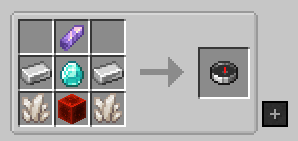

## What is a Rift Chunk?
**A rift chunk** is a tear in spacetime located the Overworld. it's used to grow 
the **TARDIS Coral** or syphened for [**Artron energy**]({{ site.baseurl }}) that the TARDIS uses for fuel.
You can fly the TARDIS into a rift chunk to syphen fuel more efficiently ( faster ) or as an alternative, you can use an **Artron Collector** 
to collect **Artron energy** while outside of the TARDIS. To find more information about the **Artron Collector** navigate to the [**Artron energy**]({{ site.baseurl }}) webpage.

## How do I find a Rift Chunk?

To locate a rift chunk, you will need to craft a **Rift Scanner** with the recipe below:

The **Rift Scanner** is a hand-held device that acts very similarly to a compass, but instead homes in on **Rift Chunks**. To locate a **Rift Chunk** using
this device, simply right click the rift scanner in your hand and follow the dial to you destination.
The device will point to the centre of the **Rift Chunk**, when you are at the centre it will spin frantically.
