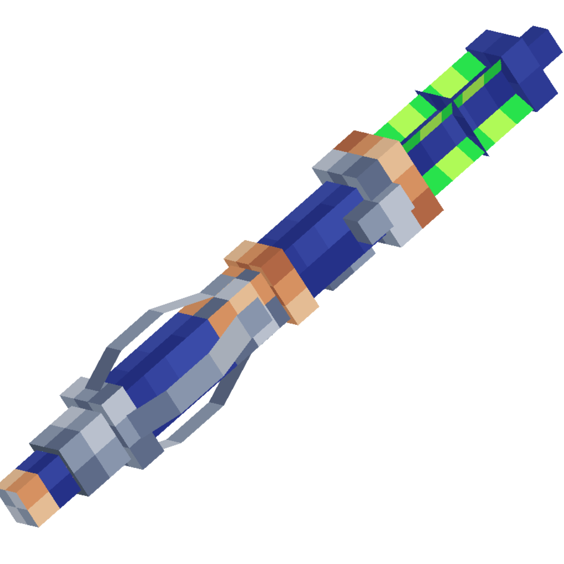
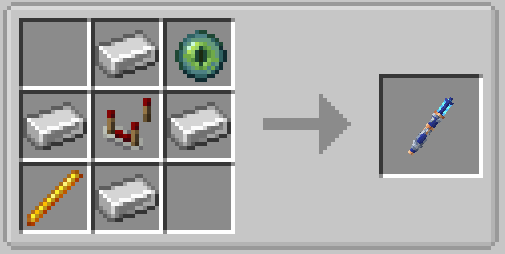

# Sonic Screwdriver    

The Sonic Screwdriver is a handheld device used for various tasks, these tasks range from seeing what parts of the console are linked to what controls to blowing up TNT. More explained below!

# Crafting Recipe
The Sonic Screwdriver crafting recipe is this:

# Sonic Modes

The sonic has 5 modes, those modes are:

- Powered Off 
- Interaction
- Overload
- Scanning
- TARDIS

**Powered off** mode renders the Sonic Screwdriver unuseable, this will be used as a form of power saving mode for the Sonic Screwdriver once the power feature has been implemented.

**Interaction** mode allows the Sonic Screwdriver to ignite candles, campfires and unlit torches.

**Overload** mode allows the Sonic Screwdriver to ignite TNT!

**Scanning** mode allows the Sonic Screwdriver to tell you what console controls are by hovering over the [**Console Entities**]({{ site.baseurl }}). It will also confirm if you are located inside of a [**Rift Chunk**]({{ site.baseurl }}) and how much [**Artron Energy**]({{ site.baseurl }}) is stored in that chunk.

**TARDIS** mode allows the Sonic Screwdriver to set the destination of the TARDIS wherever you right click, as long as its avalilable to land, and deactivates the handbrake.

