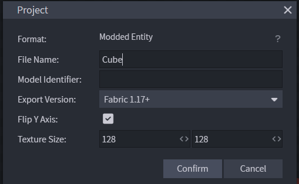
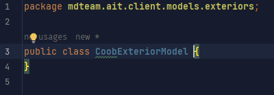
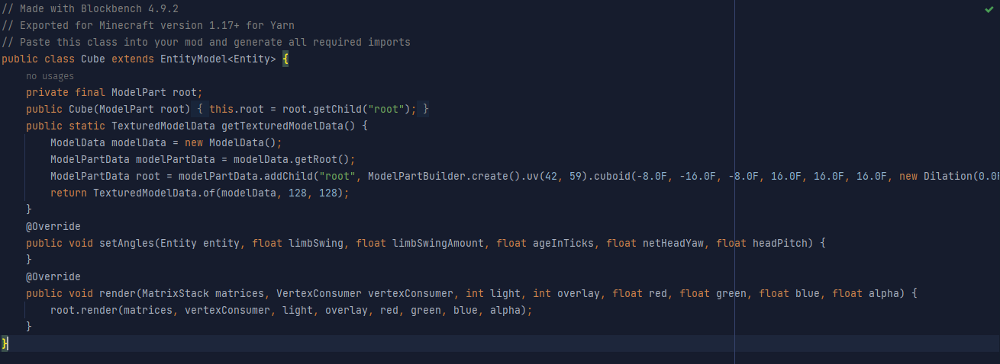
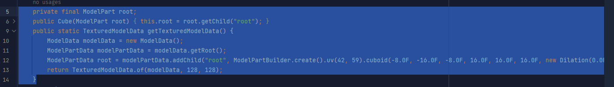
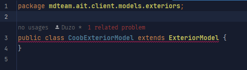

# Adding a new exterior
### *27/12/23 - duzo*
### *i refuse to use github wikis : )*

### In this tutorial, I will  be adding RED CUBE.
### This project assumes you have basic java knowledge + common sense + intellij/vcs knowhow

## BlockBench 
You will need to have a model made in BlockBench 

It is **required** that is is a **Modded Entity** and you project is exporting with **Fabric 1.17+** ( see below )

**This is under File -> Project**

## Step 1 - Exporting
To export the model, you will go to **File -> Export -> Export Java Entity**

This will give you a `.java` file, keep it somewhere temporary for now.

## Step 2 - Adding the model file
Now this is where it ramps up in difficulty if you're new to this.

In your intellij, you will need to navigate to `src/main/java/mdteam/ait/client/models/exteriors` ( this is where the models are stored )

Here, right click and create a new **Java Class** and give it a name ( try to match the other classes! )

You will see an empty class, like this:

Good job future starter.

---

Now, you will need to actually add in the **code version** of your model.

This is in the `.java` file from earlier.
Which you should now open to find something like this:

This step is simple, what you need to do is **copy paste** the parts i show below

if you dont have a `root` or something similar, you may have setup your folder structure in your model wrong. Make sure there is **ONE** main group from which all your other groups reside.

---

Now you will need to make your class **inherit** from `ExteriorModel` ( look up inheritance if your own time, im not explaining it. )

To do this, after the class' name add `extends ExteriorModel` like so

This is so that the code recognises your model as an **Exterior**

However right now, it will give you errors, this is because the code essentially is unable to **use** your model because you have not given it the **instructions/information** it requires.

Luckily for you, you can generate a fill in the blank by 
- **right-clicking** the red underline
- show context actions
- implement methods
- "ok"

TODO - finish this part, explaining how to add models is annoying. If you need help ask Duzo/Loqor or look at the other `ExteriorModel`s for reference.l